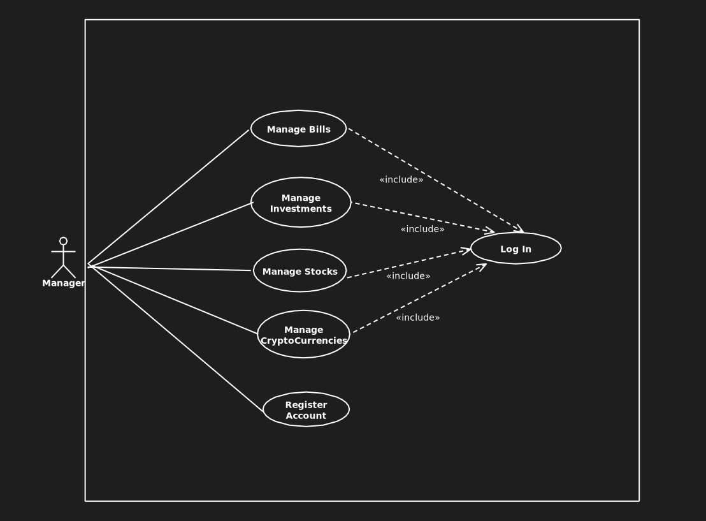
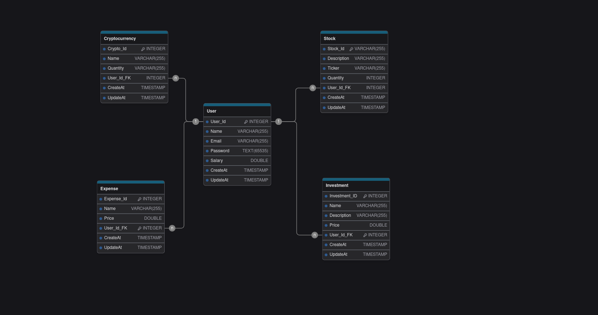

# Capital Mind - Sistema de Controle de Finanças Pessoais

> Em Desenvolvimento

## Visão Geral

O **Capital Mind** é um sistema robusto de controle de finanças pessoais, projetado para simplificar a gestão de despesas, criptomoedas, ações e investimentos. Com foco em eficiência e segurança, o Capital Mind utiliza arquitetura hexagonal, que garante flexibilidade e fácil adaptação às mudanças no sistema, separando claramente as camadas de domínio, aplicação e infraestrutura.

## Funcionalidades

### Para o Usuário:

- **Gerenciar Despesas**: Controle diário de despesas com categorização detalhada.
- **Gerenciar Criptomoedas**: Visualização e administração de portfólios de moedas digitais.
- **Gerenciar Ações**: Acompanhamento e gestão de investimentos em ações.
- **Gerenciar Investimentos**: Planejamento e acompanhamento de diversos tipos de investimentos.
- **Cadastro de Usuário**: Criação de contas para acesso seguro e personalizado.

## Arquitetura

O **Capital Mind** adota uma arquitetura **Hexagonal** (também conhecida como **Arquitetura de Ports e Adapters**), com os seguintes benefícios:

- **Desacoplamento entre a Lógica de Negócios e Tecnologias Externas**: A lógica central da aplicação está isolada das tecnologias externas, permitindo mudanças sem afetar a estrutura interna do sistema.
- **Flexibilidade e Escalabilidade**: O sistema pode ser facilmente adaptado para integrar novos serviços, como bancos de dados, APIs externas ou outros sistemas, sem a necessidade de reescrever a lógica de negócios.
- **Manutenção Facilitada**: Cada componente tem uma responsabilidade clara e é modularizado, facilitando a manutenção e a evolução do sistema à medida que ele cresce.

Para mais detalhes sobre a estrutura da arquitetura e como ela se organiza em relação ao seu sistema, acesse [a descrição completa da arquitetura](./api/src/main/java/gustavo/ventieri/capitalmind/docs/architecture/hexagonArchitecture.md).

## Tecnologias Utilizadas

### Back-End:

- **Java 21**
- **Spring Boot 3**:
  - Spring Security
  - Lombok
  - Spring Web
  - Spring Dev Tools
  - Swagger
  - Spring Dotenv
- **Hibernate**
- **Docker**
- **PostgreSQL**

### Front-End:

- **React**
- **TypeScript**
- **Material UI**

## Diagramas

### Diagrama de Caso de Uso

Este diagrama representa as interações dos usuários com o sistema.



---

### Modelo Entidade-Relacionamento (MER)

O modelo abaixo detalha a estrutura do banco de dados e os relacionamentos entre as tabelas.



---

## Como Executar o Projeto

### Back-End:

1. Clone este repositório:
   ```
   git clone https://github.com/seu-usuario/capital-mind.git
   ```
2. Certifique-se de ter o **Docker** instalado.
3. No diretório raiz do projeto, execute o seguinte comando:
   ```
   docker-compose up --build
   ```
4. Abra o navegador e acesse
   ```
   http://localhost:8080
   ```

### Front-End:

1. No diretório do front-end, instale as dependências:
   ```
   npm install
   ```
2. Execute o aplicativo:
   ```
   npm start
   ```
3. O aplicativo estará disponível em:
   ```
   http://localhost:3000
   ```
