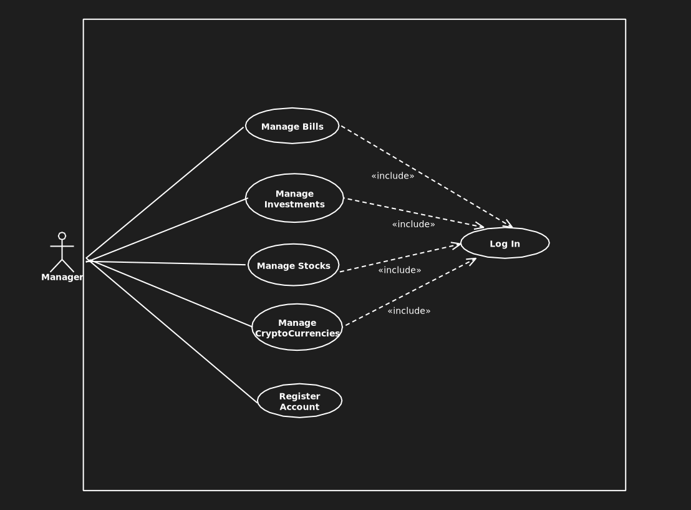
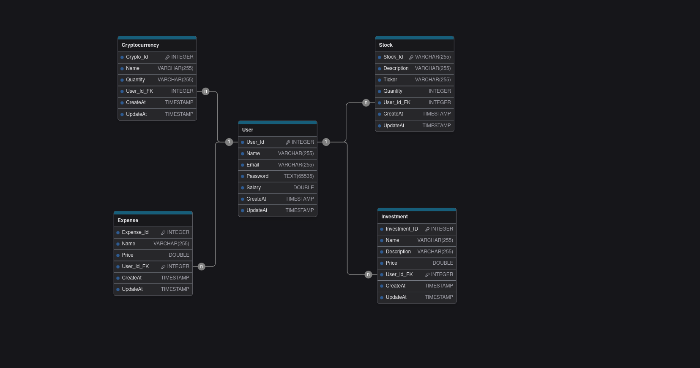

# Capital Mind - Sistema de Controle de Finanças Pessoais

> Finalizado

## Visão Geral

O **Capital Mind** é um sistema robusto de controle de finanças pessoais, projetado para simplificar a gestão de despesas, criptomoedas, ações e investimentos. Com foco em eficiência e segurança, o Capital Mind adota a arquitetura limpa, que promove uma separação clara entre as camadas de domínio, aplicação e infraestrutura, garantindo flexibilidade, testabilidade e fácil manutenção do sistema.

## Funcionalidades

### Para o Usuário:

- **Gerenciar Despesas**: Controle diário de despesas com categorização detalhada.
- **Gerenciar Criptomoedas**: Visualização e administração de portfólios de moedas digitais.
- **Gerenciar Ações**: Acompanhamento e gestão de investimentos em ações.
- **Gerenciar Investimentos**: Planejamento e acompanhamento de diversos tipos de investimentos.
- **Cadastro de Usuário**: Criação de contas para acesso seguro e personalizado.

## 🧱 Arquitetura

O **CapitalMind** adota a **Arquitetura Limpa** (Clean Architecture), que organiza o sistema em camadas bem definidas, com o objetivo de tornar o código mais desacoplado, testável e sustentável.

### 🧩 Benefícios

- **Separação de Responsabilidades**  
  A lógica de negócios (casos de uso) está isolada das camadas externas como frameworks, bancos de dados e APIs externas.

- **Independência de Tecnologias**  
  O sistema não depende de detalhes de implementação. É possível substituir bancos de dados, ferramentas ou frameworks sem afetar o núcleo da aplicação.

- **Facilidade de Testes e Manutenção**  
  A modularização e o desacoplamento permitem testar as regras de negócio de forma isolada e manter o sistema com facilidade.

- **Escalabilidade e Flexibilidade**  
  A estrutura modular permite que novas funcionalidades sejam adicionadas sem comprometer a base existente do sistema.

## Tecnologias Utilizadas

- **Java 21**
- **Spring Boot 3**:
  - Spring Security
  - Lombok
  - Spring Web
  - Spring Dev Tools
  - Swagger
  - Spring Dotenv
- **Hibernate**
- **Docker**
- **PostgreSQL**

## Diagramas

### Diagrama de Caso de Uso

Este diagrama representa as interações dos usuários com o sistema.



---

### Modelo Entidade-Relacionamento (MER)

O modelo abaixo detalha a estrutura do banco de dados e os relacionamentos entre as tabelas.



---

## Como Executar o Projeto

1. Clone este repositório:
   ```
   git clone https://github.com/gustavoventieri/CapitalMinddoc.git
   ```
2. Certifique-se de ter o **Docker** instalado.
3. No diretório raiz do projeto, execute o seguinte comando:
   ```
   docker-compose up --build
   ```
4. Abra o navegador e acesse
   ```
   http://localhost:8080
   ```
